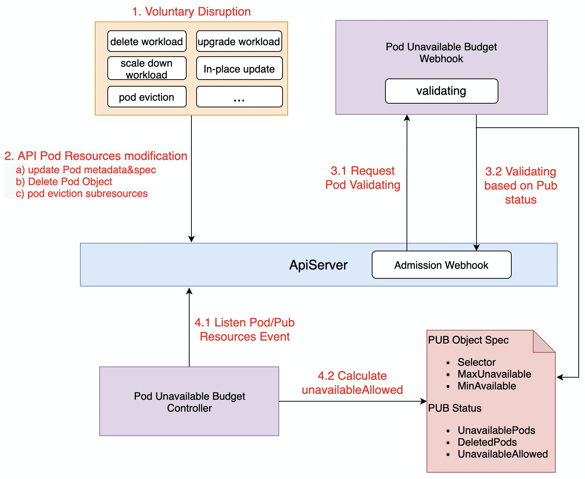

# Pod Unavailable Budget Feature

- In many voluntary disruption scenarios, PodUnavailableBudget can achieve the effect of preventing application disruption or SLA degradation through the application protection mechanism, which greatly improves the high availability of application services.

## Table of Contents

A table of contents is helpful for quickly jumping to sections of a proposal and for highlighting
any additional information provided beyond the standard proposal template.
[Tools for generating](https://github.com/ekalinin/github-markdown-toc) a table of contents from markdown are available.

- [Title](#title)
  - [Table of Contents](#table-of-contents)
  - [Motivation](#motivation)
  - [Proposal](#proposal)
    - [API Definition](#inject-containers)
    - [Implement](#hot-upgrade)
    - [Program Comparison]()
  - [User Cases](#user-cases)
    - [A Sample Case](#a-sample-case)
  - [Implementation History](#implementation-history)

## Motivation

In kubernetes, powerful workloads (e.g., deployment, statefulset, etc.) are often used to define and manage applications. It not only manages the number of pods of the application, but also provides powerful rolling capabilities such as MaxUnavailable, Partition, etc. However, workload can only help the application reach the desired number of pods as fast as possible, but does not guarantee that the number of available pods will remain at the desired value at any given moment. In the following voluntary disruption scenarios, there are still business disruption SLA degradation situations:
1. when the application owner deletes the workload of application by mistake, all the associated pods will be deleted
2. When upgrading the application version, all pods are restarted at the same time due to the wrong configuration of the rolling upgrade policy, for example MaxUnavailable=0
3. Many pods are evicted when the cluster administrator upgrades the linux kernel

[Pod Disruption Budget](https://kubernetes.io/docs/concepts/workloads/pods/disruptions/) is an attempt to achieve the application protection capability through EvictionREST interface for voluntary disruption scenario. This solution can achieve a good effect of security protection in Pod Eviction scenario, but it does not achieve the application protection capability for scenarios such as rolling upgrade of workloads, mistaken deletion of workloads leading to the set of pods being deleted.

## Proposal
PodUnavailableBudget is an attempt of OpenKruise for voluntary disruption scenario, which is not only compatible with Kubernetes PDB protection for Pod Eviction scenario, but also able to support the protection ability of various scenarios such as k8s workload native rolling upgrade, kruise workload in-place upgrade and mistaken workload deletion, etc.
### API Definition
```
// PodUnavailableBudgetSpec defines the desired state of PodUnavailableBudget
type PodUnavailableBudgetSpec struct {
	// Selector label query over pods managed by the budget
	Selector *metav1.LabelSelector `json:"selector,omitempty"`

	// TargetReference contains enough information to let you identify an workload for PodUnavailableBudget
	// Selector and TargetReference are mutually exclusive, TargetReference is priority to take effect
	TargetReference *TargetReference `json:"targetRef,omitempty"`

	// Delete pod, evict pod or update pod specification is allowed if at most "maxUnavailable" pods selected by
	// "selector" or "targetRef"  are unavailable after the above operation for pod.
	// MaxUnavailable and MinAvailable are mutually exclusive, MaxUnavailable is priority to take effect
	MaxUnavailable *intstr.IntOrString `json:"maxUnavailable,omitempty"`

	// Delete pod, evict pod or update pod specification is allowed if at least "minAvailable" pods selected by
	// "selector" or "targetRef" will still be available after the above operation for pod.
	MinAvailable *intstr.IntOrString `json:"minAvailable,omitempty"`
}

// TargetReference contains enough information to let you identify an workload for PodUnavailableBudget
type TargetReference struct {
	// API version of the referent.
	APIVersion string `json:"apiVersion,omitempty"`
	// Kind of the referent.
	Kind string `json:"kind,omitempty"`
	// Name of the referent.
	Name string `json:"name,omitempty"`
}
```

### Implement
This program customizes the PodUnavailableBudget (later referred to as PUB) CRD resource to describe the desired state of the application, and the working mechanism is shown below:



1. Many voluntary disruption scenarios can be summarized as modifications to Pod resources, which are divided into the following three categories.
    a) Modification of Pod metadata and spec section
    b) DeletionPod, i.e. DeletionTimestamp assignment
    c) pod eviction subResources
2. Pod PUB validating is based on the kubernetes admission webhook mechanism, which decides whether to allow this operation to be executed based on the UnavailableAllowed in the PUB Status:
    a) When UnavailableAllowed>0, the operation is allowed
    b) When UnavailableAllowed<=0 means that the operation is not allowed and the modification to the pod resource will be rejected.
3. Pub Controller dynamically modifies the UnavailableAllowed according to Pods

### Program Comparison
PodDisruptionBudget implements protection against Pod Eviction based on the EvictionREST interface, while PodUnavailableBudget intercepts all pod modification requests through the admission webhook validating mechanism (Many voluntary disruption scenarios can be summarized as modifications to Pod resources), and reject the request if the modification does not satisfy the desired state of the Pub.

For example, etcd stateful service is deployed in a cluster using statefulset, and currently it has five replicas in total. Based on the implementation principle of etcd, the status of etcd is available when the number of replicas >= 3, so MinAvailable=3 is defined for the corresponding PUB. etcd application administrator mistakenly sets replica=2 when the service is scaled down, and the replicaset controller listens to the configuration change and starts scaling down one by one. When the third pod is deleted, the PUB webhook rejects the replicaset controller's request to delete the pod according to the expected state of MinAvailable=3, thus ensuring the high availability of etcd services in the voluntary disruption scenario.
## User Cases
### A Sample Case
sample podUnavailableBudget MaxUnavailable = 2
```
apiVersion: policy.kruise.io/v1alpha1
kind: PodUnavailableBudget
metadata:
  name: nginx-pub
spec:
  minAvailable: 2
  targetRef:
    apiVersion: apps.kruise.io/v1alpha1
    kind: CloneSet
    name: nginx
```

nginx cloneSet replicas = 3
```
apiVersion: apps.kruise.io/v1alpha1
kind: CloneSet
metadata:
  labels:
    app: nginx
  name: nginx
spec:
  replicas: 3
  selector:
    matchLabels:
      app: nginx
  template:
    metadata:
      labels:
        app: nginx
    spec:
      containers:
      - name: nginx
        image: nginx:alpine
```

Mistake delete nginx, pub ensures that at least two pods ready
```
# kubectl delete -f cloneset.yaml
cloneset.apps.kruise.io "nginx" deleted

# kubectl get pods
NAME                                READY   STATUS    RESTARTS   AGE
nginx-jdtzt                         1/1     Running   0          77s
nginx-q7fbc                         1/1     Running   0          77s
```

## Implementation History

- [ ] 06/14/2021: Proposal submission
